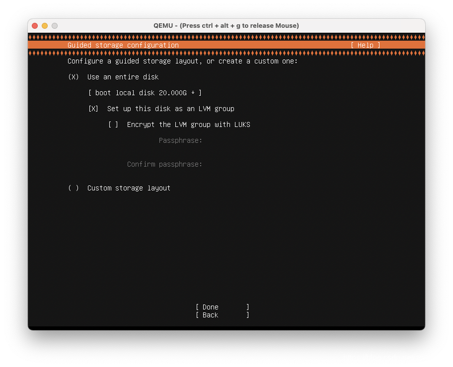

# macbook M1运行arm64虚拟机 #

**前言**

macbook 最新的架构是M1的架构，这个是一个aarch64的cpu架构，之前的一些项目中接触到很多arm相关的东西，包括一些虚拟化的一些东西

parallels这个是一个商业软件，也是mac上面比较成熟的虚拟化软件，这个是收费的，在macbook m1 刚出的时候，出过一个免费的测试版本供大家测试，测试完成以后，马上就不能用了，需要licence，这个也正常，并且当时还有个bug，是底层的内核内核不支持PAGESIZE为64K的问题，而centos7默认已经是64K的，这个不清楚后面修改没，可以通过改内核来运行,这个后续看下qemu这边有没有类似的问题

本篇是用的qemu来实践的

**操作过程**

下载软件

https://github.com/KhaosT/ACVM/releases/download/v1.0-4/ACVM.zip

这个软件是已经打好的版本，我们直接解压使用，带图形界面的使用比较方便，使用过程中存在一个问题，无法识别到盘的问题
解压后直接就是一个二进制的，双击运行即可


然后需要下载一个iso和创建一个空的img文件

在二进制上面显示包内容，然后进入到子目录ACVM.app/Contents/Resources，这个里面有个qemu-img的命令，可以用来创建系统盘

```
zphj1987@zphj1987deMacBook-Pro Resources % ./qemu-img create -f qcow2 -o size=20G  /Users/zphj1987/Downloads/myhost/ubuntu.img
Formatting '/Users/zphj1987/Downloads/myhost/ubuntu.img', fmt=qcow2 cluster_size=65536 extended_l2=off compression_type=zlib size=21474836480 lazy_refcounts=off refcount_bits=16
```

如果上面的命令不让执行，就执行下签名相关的操作

```
sudo codesign --force --deep --sign -  qemu-img
sudo codesign --force --deep --sign -  qemu-system-aarch64
```

下载一个ubuntu的arm64的iso

	ubuntu-20.04.2-server-arm64.iso

运行acvm，并把上面的img和iso拖进去


到这里可以看到没有识别到磁盘
这个地方经过分析，应该是启动使用的是nvme的磁盘驱动，而nvme在系统里面磁盘没有被识别到

```
zphj1987@zphj1987deMacBook-Pro Resources % ps -ef|grep nvme
  501 14757 14756   0  5:47PM ??         1:37.12 /var/folders/k2/dhjmhxb116sdn23hly6wvygh0000gn/T/AppTranslocation/CFDAB508-6D38-420A-B4F2-3631D1064DC0/d/ACVM.app/Contents/Resources/qemu-system-aarch64 -M virt,highmem=no -accel hvf -cpu host -smp 2 -m 2G -bios /private/var/folders/k2/dhjmhxb116sdn23hly6wvygh0000gn/T/AppTranslocation/CFDAB508-6D38-420A-B4F2-3631D1064DC0/d/ACVM.app/Contents/Resources/QEMU_EFI.fd -device ramfb -device qemu-xhci -device usb-kbd -device usb-tablet -nic user,model=virtio -rtc base=localtime,clock=host -drive file=/Users/zphj1987/Downloads/myhost/ubuntu.img,if=none,id=boot,cache=writethrough -device nvme,drive=boot,serial=boot -device intel-hda -device hda-duplex -drive file=/Users/zphj1987/Downloads/ubuntu-20.04.2-m1-server-arm64.iso,media=cdrom,if=none,id=cdimage -device usb-storage,drive=cdimage
```

这个是命令行捕获的参数，可以看到有个

	-device nvme,drive=boot,serial=boot

所以需要修改下代码，还好作者也开源了代码，直接修改即可

**下载代码**

源码地址在这里

    https://github.com/KhaosT/ACVM/archive/refs/tags/v1.0-4.zip

解压后的代码是这样的


这个地方就需要下载xcode进行编译了，xcode的下载有11G，这个就需要等待一会了
下载完成后，打开项目的目录，导入项目


修改ViewController.swift文件里面的

```
“-device”, “nvme,drive=boot,serial=boot”,
为
“-device”, “virtio-blk,drive=boot,serial=boot”,
```

修改好了以后进行编译


这个Products目录里面就是生成的二进制，改好了以后


然后删除掉之前的程序，运行改好的程序

```
sh-3.2# ps -ef|grep qemu
  501 15317 15309   0  6:22PM ??         0:13.46 /Users/zphj1987/Downloads/myhost/ACVM.app/Contents/Resources/qemu-system-aarch64 -M virt,highmem=no -accel hvf -cpu host -smp 4 -m 4G -bios /Users/zphj1987/Downloads/myhost/ACVM.app/Contents/Resources/QEMU_EFI.fd -device ramfb -device qemu-xhci -device usb-kbd -device usb-tablet -nic user,model=virtio -rtc base=localtime,clock=host -drive file=/Users/zphj1987/Downloads/myhost/ubuntu.img,if=none,id=boot,cache=writethrough -device virtio-blk,drive=boot,serial=boot -device intel-hda -device hda-duplex -drive file=/Users/zphj1987/Downloads/ubuntu-20.04.2-m1-server-arm64.iso,media=cdrom,if=none,id=cdimage -device usb-storage,drive=cdimage
    0 15323 15273   0  6:22PM ttys001    0:00.00 grep qemu
```

可以看到有

	-device virtio-blk,drive=boot

就是改好的
注意下，之前的程序如果占用的情况，可能出现没替换成功的，这个通过检查运行目录查看下，就是上面的ps查询到的命令的路径

到这个界面显示，就是可以了



然后就可以安装好了，这里修改了这个磁盘参数解决磁盘识别的问题，后续我们需要改其它的地方，也是可以在同一个文件里面修改的


可以看到ubuntu的系统的pagesize还是4K的，这个后续再看下centos的安装情况

**更新**

由于升级了macos版本，sdk的版本引起变化，重新打了个版本可以使用的
这里也提供一个打好的acvm(后缀自己改下，分享类型限制)

	https://www.aliyundrive.com/s/Pv9ntLFA6d3

如图,运行在11.5.1的os环境下


**另一个虚拟化软件**

如果觉得上面的比较麻烦可以直接使用utm，这个也是基于qemu做的，直接支持了m1平台，并且官方有维护在，可以持续更新，功能也更丰富，创建的时候选择aarch64的架构就行

	https://mac.getutm.app/


**总结**

我们需要开发编译arm相关的软件的时候，往往很难找到性能比较好的机器，树莓派什么的性能肯定是不足的，而华为鲲鹏那种arm机器又不是每个人都可以去调用资源，安培的机器也不菲，如果正好需要开发arm相关的，比如飞腾什么的，自己弄个M1的机器，然后用这个Qemu + HVF的硬件加速虚拟化还是很方便的

————————————————

版权声明：本文为CSDN博主「zphj1987」的原创文章，遵循CC 4.0 BY-SA版权协议，转载请附上原文出处链接及本声明。

原文链接：https://blog.csdn.net/zphj1987/article/details/118763680